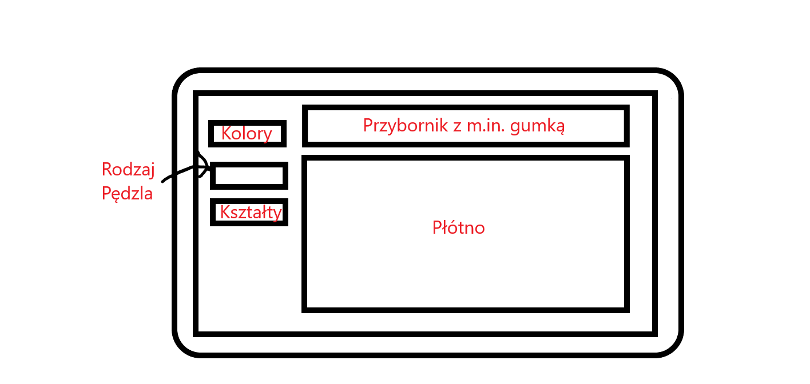
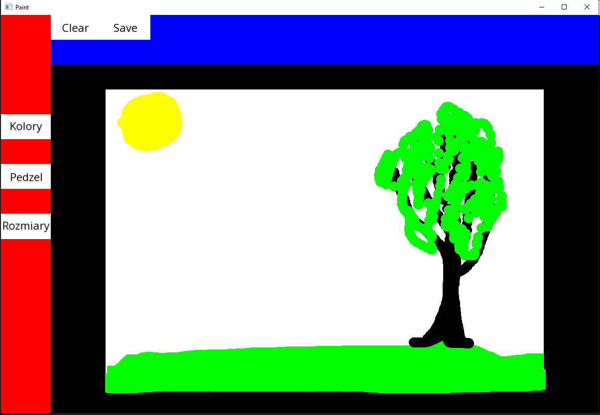
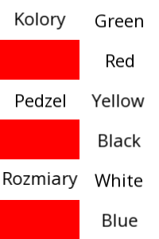
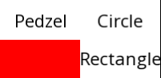
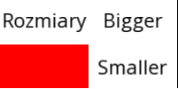

# Paint (08.2020)
Prosta aplikacja umożliwiająca użytkownikowi tworzenie obrazków i następnie eksportowanie ich po plików png.  

## Wymagania funkcjonalne:
* Rysowanie na płótnie,
* Wyczyszczenie płótna,
* Zmiana koloru pędzla,
* Zmiana kształtu pędzla,
* Zapisanie obrazku do pliku png.

## Projekt widoku aplikacji:

    

## Technologie:
* Główny język - C++,
* GUI - SFML (biblioteka graficzna języka C++).

## Zrzuty ekranu:

Widok aplikacji z utworzonym przykładowym obrazkiem:

    

Wybór koloru pędzla:

    

Wybór kształtu pędzla:

    

Zmiana rozmiaru pędzla:

    

